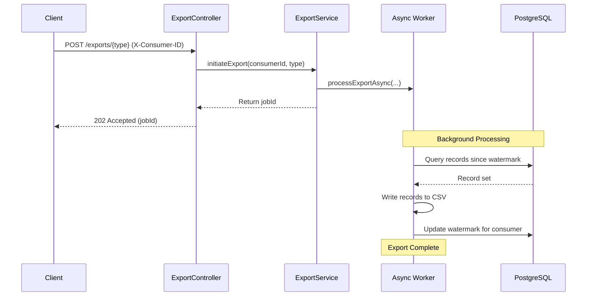

# System Architecture

This document provides a high-level overview of the CDC Watermark API's architectural design.

## The 3-Tier Model

The application follows the classic 3-tier architecture to ensure separation of concerns and maintainability:

1.  **Controller (The Waiter):** `ExportController` handles incoming HTTP requests, validates input (like the `X-Consumer-ID` header), and returns immediate responses.
2.  **Service (The Kitchen):** `ExportService` contains the core business logic. It handles the complexity of determining which records to export and managing the export lifecycle.
3.  **Repository (The Pantry):** `UserRepository` and `WatermarkRepository` abstract the data access layer, using Spring Data JPA to interact with the PostgreSQL database.

## The Asynchronous Pattern

To ensure the system remains responsive, even when handling large data exports (e.g., 100k+ rows), we use the `@Async` pattern.

-   When an export is triggered, the **Controller** immediately returns a `202 Accepted` response with a `jobId`.
-   The actual data extraction and CSV writing happen in a **background thread** managed by Spring's task executor.
-   This prevents the main request thread from being blocked, allowing the API to handle other requests concurrently.

## Request Flow Visualization

The following diagram illustrates the interaction between components during an export request:

## Future Scalability Considerations
While the current architecture uses Spring's `@Async` thread pool for background processing, it is designed to easily scale out. 
For a truly massive, distributed production system, the `ExportService` could be decoupled. Instead of processing the CSV locally, the `ExportController` would push the `jobId` to a message queue (like **RabbitMQ** or **AWS SQS**). A fleet of separate Worker Microservices would then consume those messages, generate the files, and upload them directly to cloud storage (like AWS S3).
