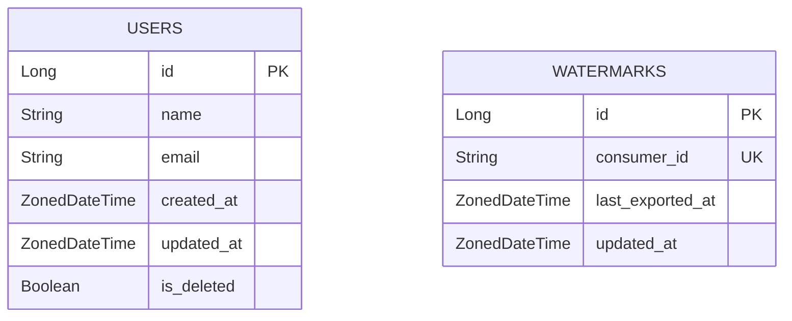

# Database Design & State Management

This document explains how the system tracks data changes and consumer progress.

## The "Bookmark" Concept (Watermarking)

A core requirement of Change Data Capture (CDC) is ensuring that clients receive data only once, and no data is lost during transitions. We achieve this using a "Watermark" or "Bookmark" system.

Imagine reading a book:
- The **database** is the book.
- The **Watermark** is your bookmark.
- When you finish reading for the day (an export job), you move the bookmark to the last page read.
- The next time you open the book, you start exactly where the bookmark is.

## Core Tables

The system relies on two primary tables in PostgreSQL:

### 1. `users` Table
This is our primary data source.
- **`updated_at` (Indexed):** This timestamp is critical. Every time a record is modified, this field is updated. An index on this column is mandatory to ensure that the CDC queries (which filter by time) remain performant even with millions of rows.
- **`is_deleted`:** A boolean flag used for soft-deletes. This allows the system to communicate deletions to downstream consumers during a "Delta" export.

### 2. `watermarks` Table
This table stores the state for each consumer.
- **`consumer_id` (Unique):** Identifies the client (e.g., "Analytics-Team-A").
- **`last_exported_at`:** Stores the timestamp of the last record successfully exported for this consumer. This acts as the "bookmark".

## Persistence and Reliability

The watermark is **only** updated after the CSV file has been successfully written to the `output/` directory. This ensures that if the process crashes mid-export, the watermark remains at the old value, and the next run will re-attempt the export from the same point, guaranteeing zero data loss.

## Entity-Relationship Diagram

