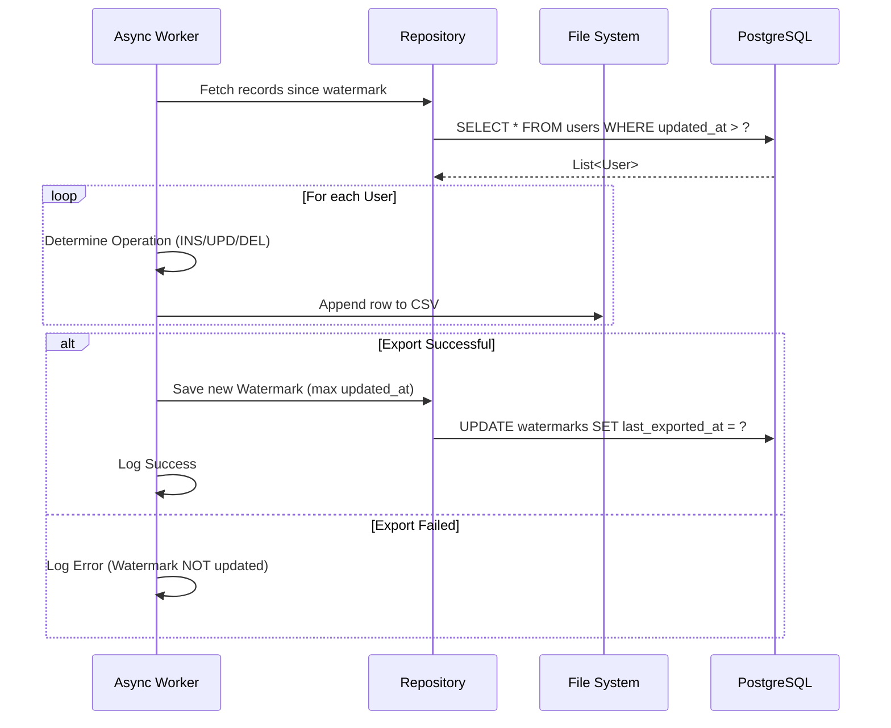

# The CDC Extraction Workflow

This document provides a deep dive into the technical logic of the Change Data Capture (CDC) engine.

## The Delta Logic

The most complex part of the system is the "Delta" export. Unlike "Full" or "Incremental" exports, Delta must identify the specific type of change for every record. It does this by comparing timestamps and checking the soft-delete flag:

-   **INSERT:** Identified when `created_at` equals `updated_at`. This means the record appeared for the first time since the last watermark.
-   **UPDATE:** Identified when `updated_at` is greater than `created_at` and `is_deleted` is `false`. This means an existing record was modified.
-   **DELETE:** Identified when the `is_deleted` flag is `true`. Even if the record was modified, the fact that it is now marked as deleted takes precedence.

## Transactional Safety

Ensuring data integrity is paramount. Requirement #9 states that the watermark must only advance if the export succeeds.

1.  The system queries the database for records.
2.  It streams these records into a CSV file.
3.  **Crucially**, it only updates the `watermarks` table *after* the file writing process is finished.
4.  If an `IOException` or database error occurs during writing, the `updateWatermark` method is never called. This prevents "skipping" data on the next attempt.

## Workflow Visualization

The following sequence diagram shows the internal logic of the background thread (`processExportAsync`):

