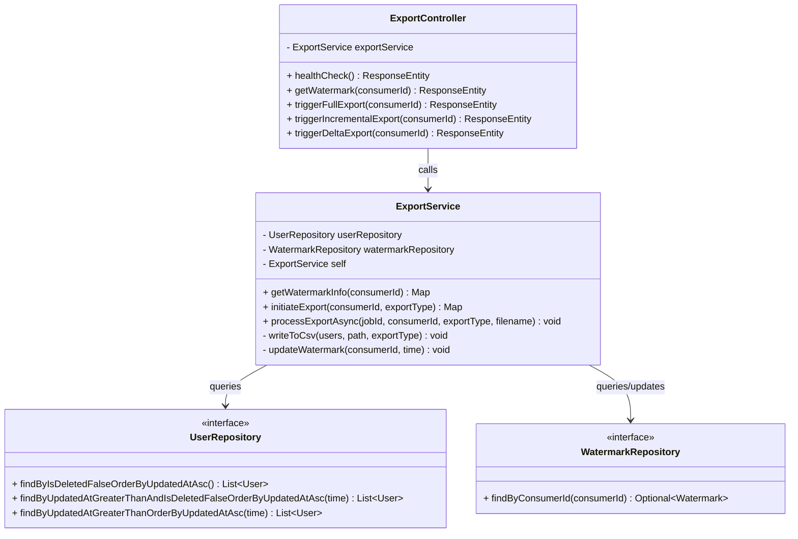

# Low-Level Design (LLD) & Class Architecture

This document details the internal class structure and the design patterns used to implement the CDC Watermark API.

## Design Patterns Used

-   **MVC Pattern:** The application follows the Model-View-Controller architecture. We have separated the Web layer (`ExportController`), Business layer (`ExportService`), and Data layer (`UserRepository`, `WatermarkRepository`).
-   **Proxy Pattern (Self-Injection):** To enable `@Async` behavior within the same class, we use a self-injection proxy. This allows the `initiateExport` method to call `processExportAsync` through the Spring AOP proxy, ensuring a new thread is spawned.
-   **Repository Pattern:** Spring Data JPA is used to abstract raw SQL into clear, interface-based repository methods.
-   **Soft Delete Pattern:** The `User` model includes an `is_deleted` flag instead of physically removing records, which is essential for "Delta" processing.

## Class Diagram

The following diagram shows the relationships and key methods of the core Java classes:

