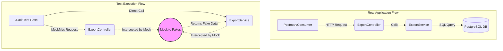

# Testing Strategy & Coverage

This document explains our approach to verifying the stability and correctness of the CDC Watermark API.

## The Testing Stack

-   **JUnit 5:** The foundation for all unit and integration tests.
-   **Mockito:** Used to create mock repositories and services, allowing us to test business logic in isolation without a running database.
-   **MockMvc:** Used to test the REST API layer (`ExportController`) by simulating HTTP requests and asserting responses.
-   **JaCoCo:** A Java Code Coverage tool that generates reports showing which lines of code are covered by tests.

## Achieving 70%+ Coverage

To meet the 70%+ coverage requirement, we focused on two main testing areas:

### 1. Controller Testing (`ExportControllerTest`)
We used `MockMvc` to verify that all endpoints return the correct HTTP status codes (e.g., `202 Accepted` for exports, `200 OK` for health) and that the `X-Consumer-ID` header is correctly handled.

### 2. Service Testing (`ExportServiceTest`)
The service logic is the heart of the application. 
- **Bypassing the Proxy:** To test asynchronous logic synchronously and accurately, we bypassed the `@Async` proxy by creating a direct instance of `ExportService`. This allows the test to wait for the CSV to be written and then verify its contents.
- **State Verification:** We mock the repositories to return specific data sets and then verify that the `updateWatermark` method is called with the correct timestamp after an export.

## Testing Flow Visualization

The following diagram shows how the tests interact with the application compared to a real environment:

